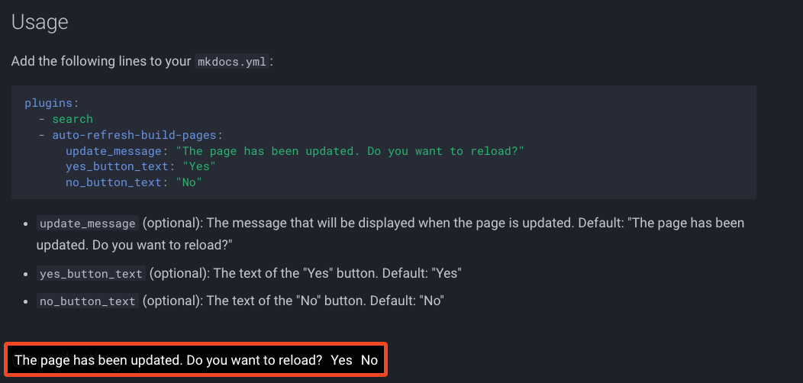

# MKDocs Auto Refresh Build Pages Plugin


<p align="center">
<a href="https://hits.seeyoufarm.com/api/count/graph/dailyhits.svg?url=https://github.com/JakubAndrysek/mkdocs-auto-refresh-build-pages"></a>
<a href="https://github.com/JakubAndrysek/mkdocs-auto-refresh-build-pages/blob/main/LICENSE" target="_blank"></a>
<a href="https://pypi.org/project/mkdocs-auto-refresh-build-pages/" target="_blank"></a>
<a href="https://github.com/JakubAndrysek/mkdocs-auto-refresh-build-pages/stargazers" target="_blank"></a>
<a href="https://github.com/JakubAndrysek/mkdocs-auto-refresh-build-pages/forks" target="_blank"></a>
<a href="https://github.com/JakubAndrysek/mkdocs-auto-refresh-build-pages/issues" target="_blank"></a>
<a href="https://github.com/JakubAndrysek/mkdocs-auto-refresh-build-pages/discussions" target="_blank"></a>
<a href="https://pypistats.org/packages/mkdocs-auto-refresh-build-pages" target="_blank"></a>
</p>


MkDocs plugin that automatically refreshes the build pages when the documentation is updated.

## Installation

Install the plugin using pip from [PyPI](https://pypi.org/project/mkdocs-auto-refresh-build-pages/):

```bash
pip install mkdocs-auto-refresh-build-pages
```

## Usage

Add the following lines to your `mkdocs.yml`:

```yaml
plugins:
  - search
  - auto-refresh-build-pages:
      update_message: "The page has been updated. Do you want to reload?"
      yes_button_text: "Yes"
      no_button_text: "No"
      check_interval_seconds: 5
```

- `update_message` (optional): The message that will be displayed when the page is updated. Default: "The page has been updated. Do you want to reload?"
- `yes_button_text` (optional): The text of the "Yes" button. Default: "Yes"
- `no_button_text` (optional): The text of the "No" button. Default: "No"
- `check_interval_seconds` (optional): The interval in seconds at which the page will be checked for updates. Default: 5

## Example screenshot




## Contributing
Pull requests are welcome. For major changes, please open an issue first to discuss what you would like to change.

## Do You Enjoy My Work?
Then you can consider:

- supporting me on GitHub Sponsors: [](https://github.com/sponsors/jakubandrysek)

## License

[MIT](https://github.com/JakubAndrysek/mkdocs-auto-refresh-build-pages/blob/main/LICENSE)